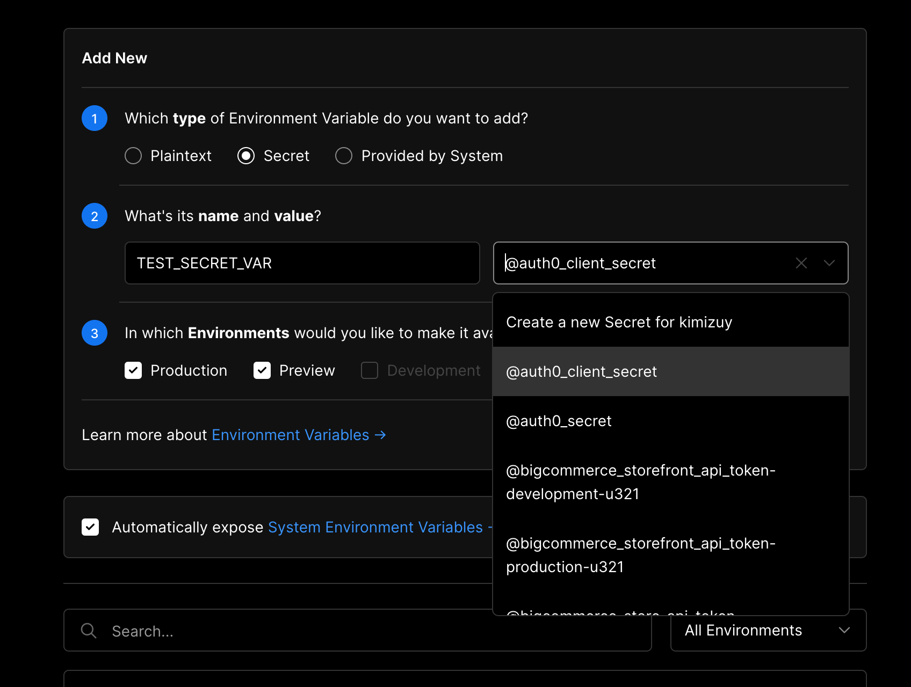

export { default as cover } from "./cover.png";

# はじめに

この記事では [Vercel CLI](https://vercel.com/docs/cli) の基本的な使い方を紹介します。

CLI で手軽にデプロイや各種設定ができると、開発の工程が削減できたり開発の幅が広げられたりします。Hobby プランならデプロイの回数は 1 日 100 回まで行えます（[詳細](https://vercel.com/docs/platform/limits)）。

# 前提条件

[Vercel](https://vercel.com/docs/cli) アカウントを持っていること

# インストール

まず`vercel`コマンドが利用できるようにします。

```bash
npm i -g vercel
```

# 基本的なコマンド

モバイル環境を確認する場合や本番の環境変数を設定する場合など、開発を円滑にするため基本的なコマンドを覚えておくと便利です。いくつかご紹介します。

## vercel

ローカルのプロジェクトが「https://~.vercel.app」という URL にデプロイされます。実際に公開された状態を気軽に確認できて便利です。

初めて `vercel` を使用する場合は、まずメールリンク認証による vercel へのログインやプロジェクトの紐づけが求められます。それらが完了するとプロジェクトのルートに`.vercel`フォルダが追加されます。

スマホ画面を実際に触って確認する場合に [localhost をスマホ実機で確認する方法](https://qiita.com/nanarya/items/8d01dfb4de434e7b8acc)もあります。デプロイしてしまったほうが本番により近い状況が再現できるため個人的にラクだと感じます。ただインターネットへ公開されることになるので、まだ非公開にしたい内容の記事なんかを誤って公開しないよう注意しましょう。

## vercel --prod

ローカルのプロジェクトが本番の URL にデプロイされます。ちょっとした手直しを反映するのに便利です。

Vercel のプロジェクトは GitHub などのレポジトリと紐づけて管理している場合が大半でしょう。つまりメインブランチの更新にともなってデプロイする流れになります。
例えば、マージ&デプロイが完了したあとに軽微な表示崩れが起きていると気づいたときに、再度コミットしてプッシュしてマージして、を繰り返すのは面倒です。そんなときに応急処置的にこのコマンドが使えます。当然、メインブランチを更新すれば再デプロイ、上書きされます。

## vercel env ls

Vercel プロジェクトに設定されている環境変数をリストアップします。

## vercel env add

Vercel プロジェクトに環境変数を対話形式で追加します。1 つずつです。複数の環境変数を一括で設定する方法があったら逆に教えてください。[GUI から追加する方法](https://vercel.com/docs/environment-variables)もあります。

## vercel env rm

Vercel プロジェクトに設定されている環境変数を削除します。

## vercel env pull

Vercel プロジェクトに設定されている環境変数をローカルにダウンロードします。

デフォルトは .env ファイルです。
例えば `vercel env pull .env.local` とすれば .env.local としてダウンロードします。

## vercel secret add `<name> <value>`

シークレットキーを追加します。プロジェクトにアクセスできる人にも知られたくないものが対象になります。

このシークレットキーはプロジェクトではなく、ユーザーアカウントに紐づけられます。以下のようにリストに追加され、そこから選択してプロジェクトに設定します。



# まとめ

とりあえず`vercel`を使っておけば簡単に初期設定とデプロイができるので便利です。

個人的に GitHub 連携していれば十分かと思っていましたが、手軽にデプロイする環境があるとより円滑に開発が進められると思いました。この記事が誰かのお役に立てれば幸いです。

# 更新

2021-02-22: secret の追加方法やリンクを追記しました。
