本記事は次の技術を利用して、メールアドレスによる認証アプリをデプロイ（公開）するまでの流れをまとめたものである。

- [Next.js](https://nextjs.org/)

- [Firebase](https://firebase.google.com/?hl=ja)

- [Vercel](https://vercel.com/)（本記事で Vercel と連携する Git クライアントは GitHub です。自身の環境で適宜、読み替えてください。）

実際の[サンプル](https://next-firebase-auth-sample.kimizuy.vercel.app)。

Next.js が用意してくれている examples の [with-firebase-authentication](https://github.com/vercel/next.js/tree/canary/examples/with-firebase-authentication) を利用し認証アプリをデプロイするまでを説明する。この雛形を使うため内容量としては Firebase : Vercel : Next.js = 7 : 2 : 1 くらいの比率になる。サービスやフレームワークに全依存すればだいたいコピペとクリックでいけるぞ！

## 前提条件

- 基本的な Git の操作ができること

- Firebase や Vercel アカウントを持っていること

- 本記事では Firebase から取得する private key や project id 等をまとめて「環境変数」と呼ぶ

## Firebase の設定

### Firebase にプロジェクトを追加する

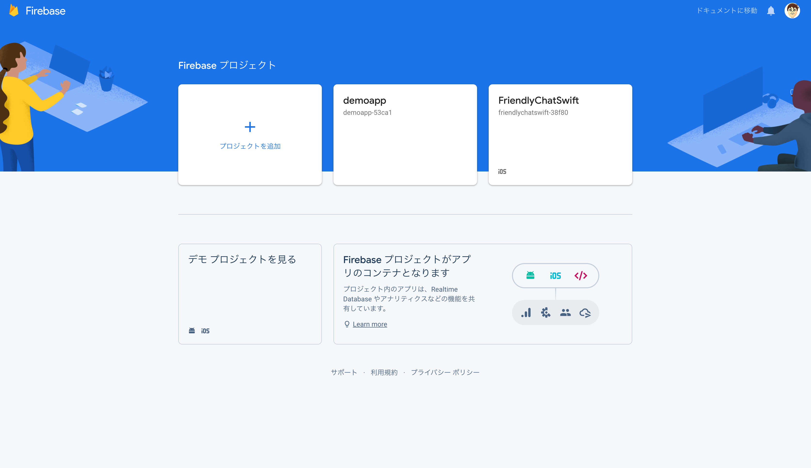

「プロジェクトを追加」をクリック。

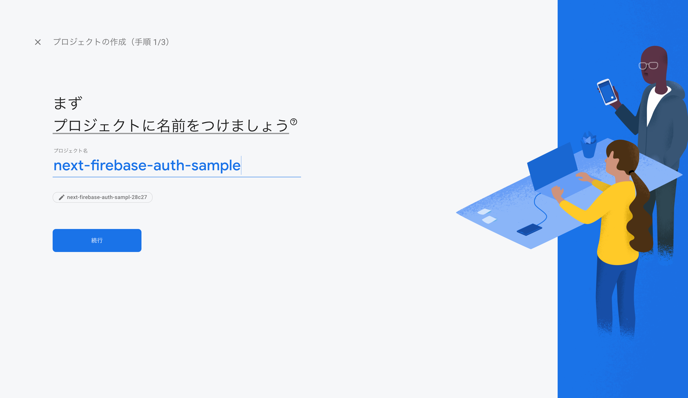

適当なプロジェクト名を入力して続行をクリック。ここでは「next-firebase-auth-sample」としている。

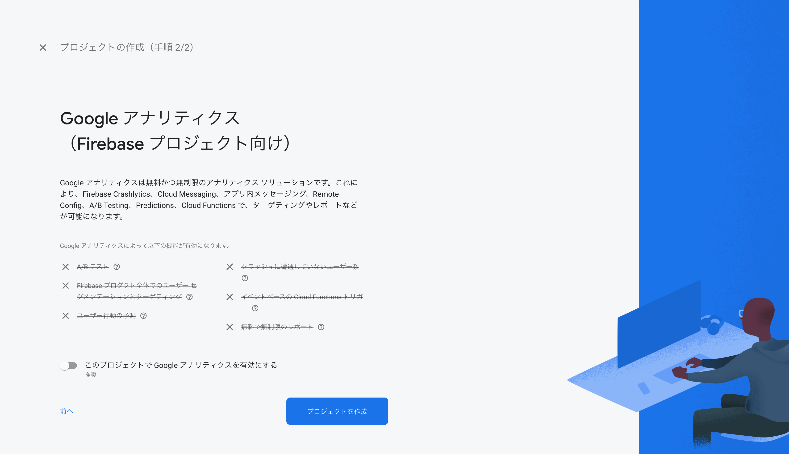

今回はサンプルアプリの作成のみなので、Google アナリティクスは無効にする。「プロジェクトを作成」をクリック。

少し待つとプロジェクト作成が完了する。「続行」をクリック。プロジェクトの追加は以上となる。

### Sign-in method でメール認証を有効にする

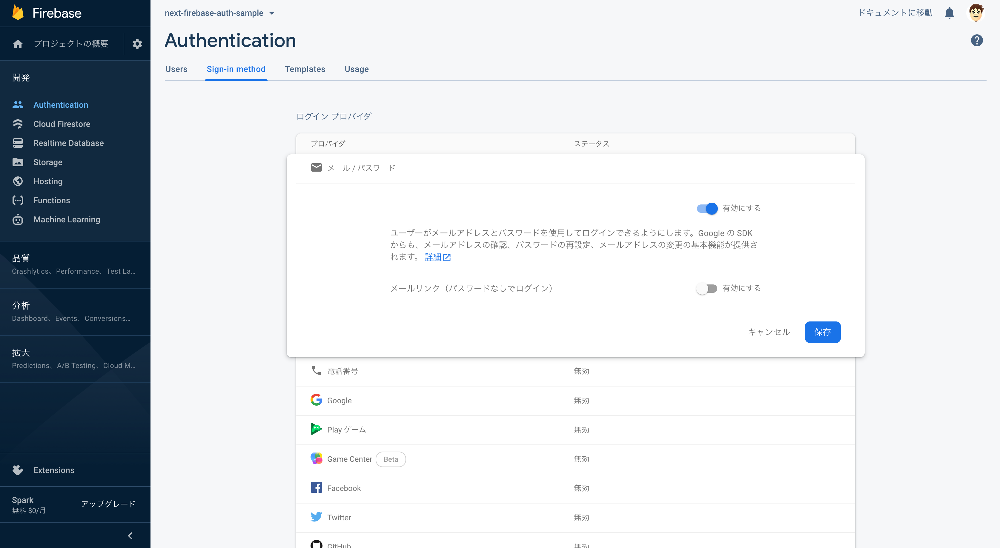

[Firebase Console](https://console.firebase.google.com/?hl=ja) を開き、先ほど追加したプロジェクトを選択する。

Authentication > Sign-in method > メール / パスワードとクリックしていき、メール認証のステータスを有効化する（メールリンクは無効のまま）。

### 環境変数を取得する (1/2)

Next.js プロジェクトと連携するため Firebase から必要な環境変数（private key 等）を取得していく。

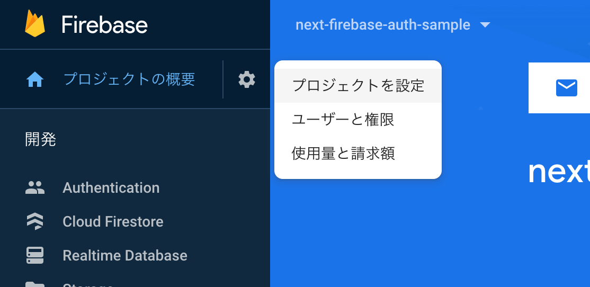

設定（歯車マーク）> プロジェクトを設定と進む。

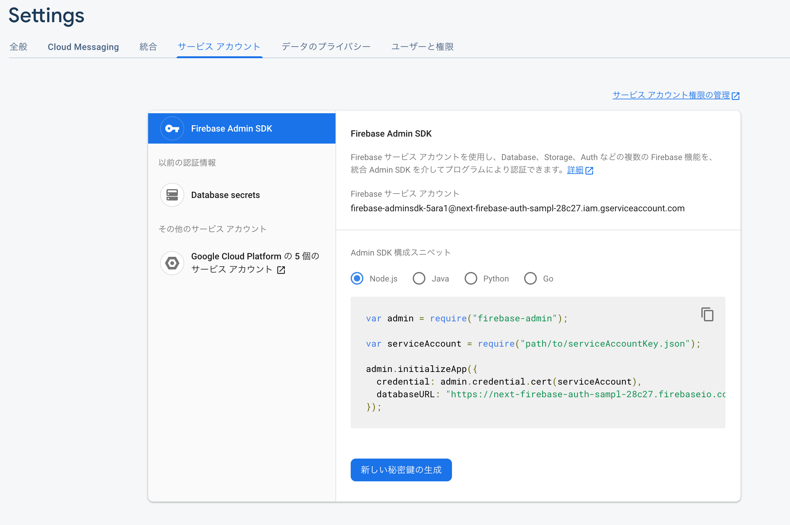

サービスアカウントタブで「新しい秘密鍵の生成」をクリック。private key などが記された JSON ファイルがダウンロードされる。

### 環境変数を取得する (2/2)

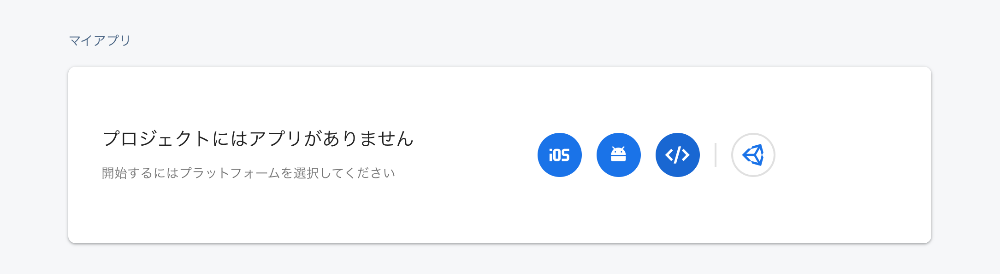

プロジェクトにアプリを追加する。プロジェクトを設定 > 全般 > マイアプリと進み、「＜/＞」（Web）アイコンをクリック。

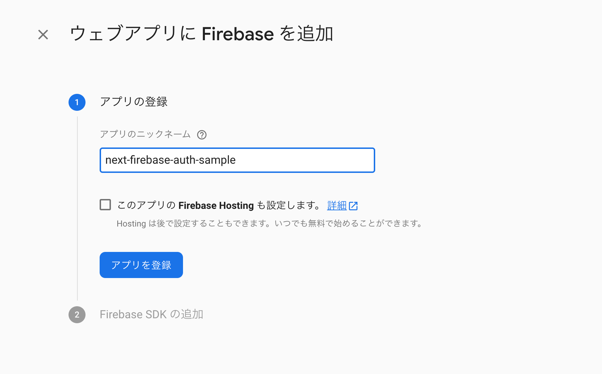

適当なアプリ名を入力してアプリを登録する。Vercel でホスティングするので Firebase Hosting は不要。

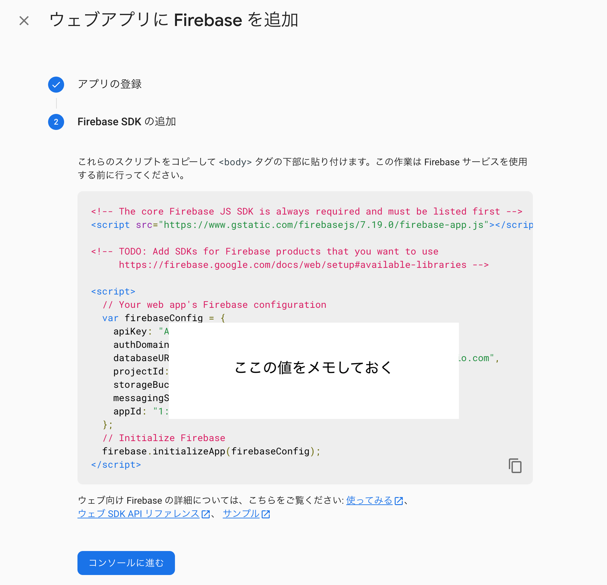

`var firebaseConfig = {...}` の値を使う。以上で環境変数の取得は完了。

## Next.js プロジェクトのローカル環境変数を設定する

ローカルの開発環境で認証アプリを動かすための設定をしていく。事前に以下の 2 点を済ませる。

- [with-firebase-authentication](https://github.com/vercel/next.js/tree/canary/examples/with-firebase-authentication) を create-next-app して Next.js プロジェクトを作る。

- このプロジェクトを自分の GitHub リポジトリにプッシュしておく.

### .env.local ファイルに取得した環境変数を設定する

.env.local ファイルは<strong>ローカルの開発環境</strong>で Firebase Authentication と連携するための環境変数設定ファイル。このファイルに環境変数を設定すれば Next.js が自動で読み込んでくれる。

※ .env.local ファイルは公開厳禁。テンプレートではすでに gitignore されているため、とくに作業は不要。

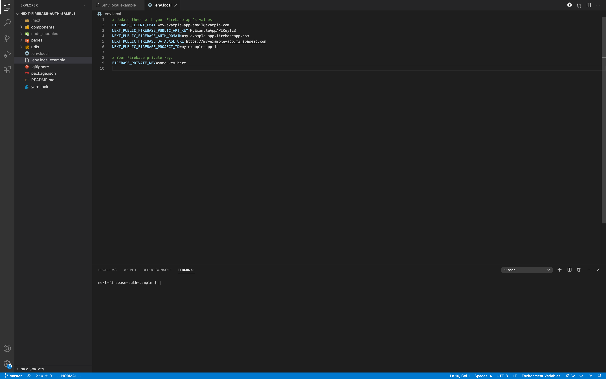

まず .env.local.example ファイルをコピーして .env.local ファイルを作る。それぞれ対応する値を設定していく。

JSON ファイルからは project_id, private_key, client_email を利用する。`var firebaseConfig = {...}`からは apiKey, authDomain, databaseUrl[^*1] を利用する。""内の値をそのままコピペ。

[^*1]: Firebase の仕様が変わったのか、firebaseConfig に databaseUrl が含まれない場合がある。プロジェクト上に Realtime Database を作成すると生成される変数なので、特に Authentication には直接関係がなく無視してよい。[関連](https://twitter.com/hapitomax/status/1335184425798123520?s=20)

環境変数を設定し終わったら`yarn dev`を実行し、ローカルでメール認証ができるか確認してみる。

認証が上手くいかない場合は、環境変数が正しく設定できているか再確認する。.env.local ファイルの値を変更すると`yarn dev`を実行し直す必要があるので注意。

## Vercel にデプロイする

### Vercel で環境変数を設定する

Vercel で「Import Project」して事前に用意しておいた GitHub リポジトリを連携する（ここでの設定はとくにないので Continue 連打で良し）。

これで認証アプリが Web 上に公開されたが、このままでは認証機能は使えない。Vercel 上で環境変数を設定する（[environment variables](https://vercel.com/blog/environment-variables-ui)）。

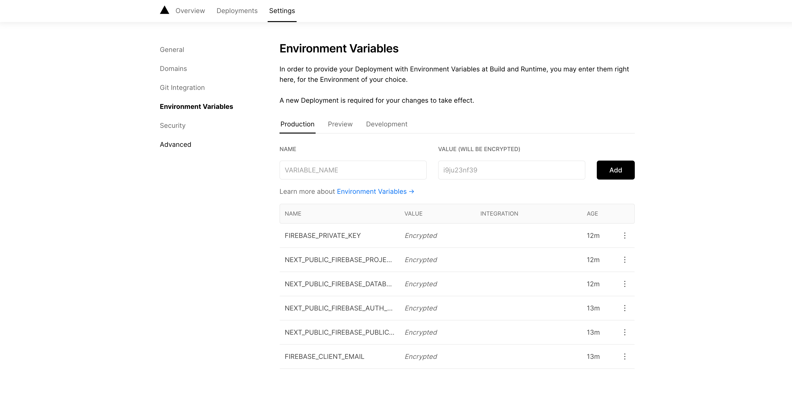

先ほど公開したプロジェクトの Settings > Environmental Variables と進む。.env.local ファイルと同じ内容をひとつずつ追加していく。

すべて設定し終わってプロジェクトが Rebuild されるのを待つ。これで Vercel の設定は完了。

YOUR_PROJECT_NAME.vercel.app 等にアクセスして認証機能が使えるか確認する。

以上！
