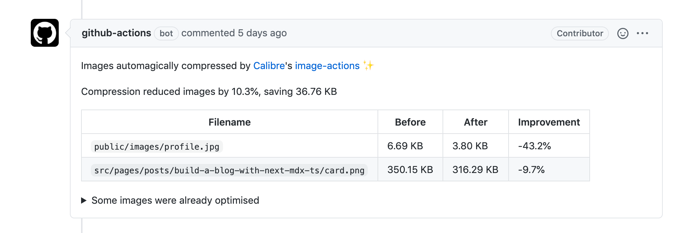

export { default as cover } from "./cover.png";

またも GitHub Actions。今回はプルリクエスト作成時に自動で画像の最適化・圧縮する方法をまとめる。かなりお手軽。

## GitHub Actions の設定ファイルを追加する

プロジェクトのルートに`.github/workflows`フォルダを作成し、その中に以下の内容のファイルを追加する。

```yaml:./.github/workflows/optimize-images.yml
name: Optimize images
on: pull_request
jobs:
  build:
    name: calibreapp/image-actions
    runs-on: ubuntu-latest
    steps:
      - name: Checkout Repo
        uses: actions/checkout@master

      - name: Compress Images
        uses: calibreapp/image-actions@master
        with:
          githubToken: ${{ secrets.GITHUB_TOKEN }}
```

また、画像の種類ごとに圧縮率をカスタマイズできる（デフォルト値はいずれも 80）

[image-quality-settings](https://github.com/calibreapp/image-actions#image-quality-settings)

```yaml
~~~
- name: Compress Images
  uses: calibreapp/image-actions@master
  with:
    githubToken: ${{ secrets.GITHUB_TOKEN }}
    jpegQuality: '80'
    jpegProgressive: false
    pngQuality: '80'
    webpQuality: '80'
    ignorePaths: 'node_modules/**,build'
    ## No spaces allowed
```

## 実際にプルリクエストを作成してみる

master に対してプルリクエストを作成すると GitHub Action が実行され、新しく追加した画像が最適化（圧縮）される。



注意点として、このアクションが実行されるとプルリクエストに最適化した画像が再度コミットされること。master ← dev のようなプルリクエストの場合、dev ブランチで差分が生じるので混乱しないようにしたい。

## 参考

[calibreapp/image-actions](https://github.com/calibreapp/image-actions)

[Optimize Images with a GitHub Action](https://css-tricks.com/optimize-images-with-a-github-action/)
