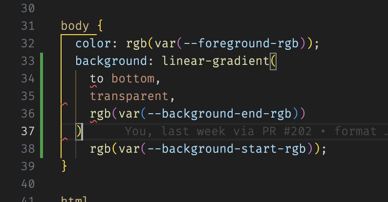

export { default as cover } from "./cover.png";

## はじめに

[Stylelint](https://stylelint.io/) の v15 からは CSS に関係しない stylistic rules (改行や空白などのコードフォーマット) が非推奨になりました。

Stylelint の開発当初はコードフォーマットライブラリが成熟していなかったため空白や改行のフォーマットも Stylelint が担っていました。現在は [Prettier](https://prettier.io/) などのライブラリが充分に発達したため、Stylelint はそれらのルールを非推奨にしました。

[Migrating to 15.0.0 - Deprecated stylistic rules](https://stylelint.io/migration-guide/to-15/#deprecated-stylistic-rules)

> When we created these rules, pretty printers (like Prettier) didn't exist. They now offer a better way to consistently format code, especially whitespace. Linters and pretty printers are complementary tools that work together to help you write consistent and error-free code.

[stylelint-stylistic](https://github.com/elirasza/stylelint-stylistic) などのコミュニティプラグインによって stylistic rules も維持可能です。

ただ、今回は特に規模の大きなプロジェクトではなく変更対象のファイルが少ないので、Prettier によるコードフォーマットへ移行することにしました。

## 方法

stylelint を介して prettier を実行できる [stylelint-prettier](https://github.com/prettier/stylelint-prettier) を使います。

```bash
npm install --save-dev stylelint-prettier prettier
```

```js:stylelint.config.js
module.exports = {
  extends: [
    "stylelint-config-standard",
    "stylelint-config-recess-order",
    "stylelint-prettier/recommended", // ← 追加
  ],
  rules: {
    "font-family-no-missing-generic-family-keyword": [
      true,
      {
        ignoreFontFamilies: "Menlo",
      },
    ],
    "selector-class-pattern": "^[a-z]|^[a-z][a-zA-Z0-9]+$",
    "comment-empty-line-before": [
      "always",
      {
        except: ["first-nested"],
        ignore: ["after-comment"],
      },
    ],
  },
};
```

これで設定は完了です。`plugins` に追加してルールをカスタマイズする方法もありますが、デフォルトルールを使うのであれば `extends` に追加するだけで OK です。

Stylelint を実行し新しい設定でフォーマットし直します。

```bash
npm run stylelint --fix **/*.css
```

### 問題発生

一箇所、インデントのリント合戦が発生し修正できなくなりました（結局、もともと不要なスタイルだったので当該箇所を削除することで対応しました）。



すでにイシューとして上がっているようです。

[I've this issue 188:3 ✖ Insert "··" prettier/prettier with --fix flag, but no error without --fix flag](https://github.com/prettier/stylelint-prettier/issues/242)

## おわりに

これまでは `stylelint-config-prettier` を使って Prettier との競合を打ち消す形でした。今後は Stylelint が stylistic rules を廃止することで Prettier との責務が明確になり、よりシンプルに運用できそうですね。

## 参考

- [Migrating to 15.0.0](https://stylelint.io/migration-guide/to-15/#deprecated-stylistic-rules)
- [｢Stylelint｣｢Prettier｣を使ってコードの品質を高める【2023年版】](https://okalog.info/stylelint/)
