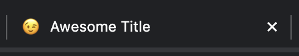

export { default as cover } from "./cover.png";

## はじめに

[絵文字をファビコンとして表示する簡単な方法](https://zenn.dev/catnose99/articles/3d2f439e8ed161)を参考に Next.js App router で Emoji を favicon に設定する方法を紹介します。

## 方法

[Metadata API](https://nextjs.org/docs/app/building-your-application/optimizing/metadata) を使って設定します。

```tsx:layout.tsx
import { type Metadata } from "next";

export const metadata: Metadata = {
  title: "Awesome Title",
  icons:
    "data:image/svg+xml,<svg xmlns=%22http://www.w3.org/2000/svg%22 viewBox=%220 0 100 100%22><text x=%2250%%22 y=%2250%%22 style=%22dominant-baseline:central;text-anchor:middle;font-size:90px;%22>😉</text></svg>",
};
```

## 結果

以下のように Favicon として Emoji が表示されます。Emoji を使うだけでも見映えがグッと良くなっていいですね。


